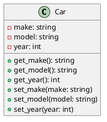

# Thesis-SomaticCoding

## Dependencies
Python 3.10.11
OpenCV 4.5.5.64
Numpy 1.24.2

### Installation
To install these dependencies, run this line in the terminal:
`pip install opencv-contrib-python opencv-python==4.5.5.64`
Numpy 1.24.2 should install automatically, but if not run:
`pip install numpy==1.24.2`

## Setup
1. Set up a python virtual environment in VSCode
2. Enter the virtual environment using `env\Scripts\activate.bat`

## Repo Structure

## UML Class Diagram

