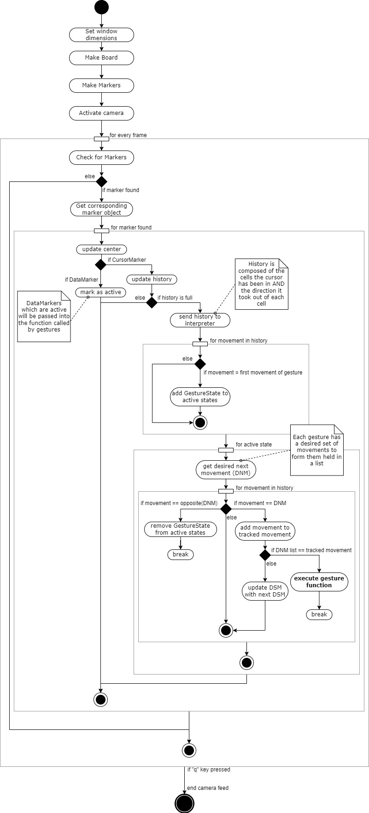

# Thesis-SomaticCoding

## About the Project
`Somatic Coding` is a form of design that seeks to reintegrate the body into computing. This iteration, entitled `Gestural Syntax` is a program that uses fiducials and gesture recognition to run string manipulations for the purpose of constructing poems. This simple form of word play is the first iteration of Somatic Coding with the long-term goal to integrate gesture into the syntax of computing. Gestural Syntax begins incorporating movement into the syntax of code, but still makes use of symbolic language in the form of data held on the fiducials. This compromise was made in order to create a more accesible version of this program, since a gestural syntax sans symbolic language would require an immense complexity, thus making the program inaccessible.

## Dependencies
Python 3.10.11
OpenCV 4.5.5.64
Numpy 1.24.2

### Installation
To install these dependencies, run this line in the terminal:
```bash
pip install -r requirements.txt
```
If that installation doesn't work, try installing OpenCV individually:
```bash
pip install opencv-contrib-python opencv-python==4.5.5.64
```
Numpy 1.24.2 should install automatically, but if not run:
```bash
pip install numpy==1.24.2
```

## Setup
1. Set up a python virtual environment in VSCode
2. Enter the virtual environment using `env\Scripts\activate.bat`
3. use `cd` to enter the `src` folder
4. Run the following in the command line:
```bash
python __init__.py
```

## Repo Structure
```
├── env/                                    # VSCode generated ./env folder for the python virtual environment
│   ├── Include/
│   ├── Lib/
│   │   └── ...                             # Packages used in this program
│   ├── Scripts/                            
│   │   ├── activate                        # Run this file to enter the python virtual environment
│   │   └── ...
│   └── pyvenv.cfg
├── markers/
│   ├── [marker_id].png                     # Images of the ArUco markers in use
│   └── ...
├── references/
│   ├── Thesis_ActivityDiagram.jpg          # Activity diagram explaining the actions the program takes to work
│   └── Thesis_ClassDiagram_Final.jpg       # Class diagram showing the way objects reference each other
├── src/
│   ├── __pycache__/
│   │   └── ...
│   ├── calibration/
│   │   ├── __pycache__/
│   │   │   └── ...
│   │   ├── calibration_images/             # Collection of images to run a calibration of the camera in use (will be generated in calibrate.py)
│   │   │   ├── image_[i].jpg
│   │   │   └── ...
│   │   ├── calibrate.py                    # Script to run calibration or to gather existing camera matrix
│   │   ├── camera_calibration_nexigo.npz   # Numpy zip folder containing camera matrix for the Nexigo webcam
│   │   └── camera_calibration.npz          # Numpy zip folder containing camera matrix for the standard Dell Inspiron webcam
│   ├── __init__.py                         # Main file to run the program
│   ├── board.py                            # Holds all objects relating to the gridded board
│   ├── calculations.py                     # Holds necessary functions for calculations
│   ├── display.py                          # Holds all objects relating to display of information
│   ├── factory.py                          # Holds all factory objects using the factory pattern to create instances of objects
│   ├── gestureBehavior.py                  # Holds all execution function objects for the corresponding gesture, utilizes the strategy pattern
│   ├── gestures.py                         # Holds all gesture objects that we are looking for from the cursor object
│   ├── loop.py                             # Loop object that __init__.py calls to setup and to make the program run
│   ├── markers.py                          # Holds marker objects and both children of the marker object (data markers and cursor marker)
│   ├── observer.py                         # Holds observer object that coordinates all actions between the display, markers, and cells
│   └── singleton.py                        # Holds singleton object that gets referenced by objects that need to only be instantiated once
├── tests/
│   ├── apiCall.py                          # Used to test the ChatGPT API calls made in the program
│   ├── gestureBehaviorTest.py              # Used to test the execution of functions when a gesture is detected
│   ├── gesturesTest.py                     # Used to test the recognition of a gesture
│   ├── observerTest.py                     # Used to test the observer to see if it is operational
│   └── versions.py                         # Used to see if we have the correct version of libraries installed and running
├── .gitignore
├── create_markers.py                       # Used to create the ArUco marker images to be printed for detection
├── LICENSE
├── README.md
├── requirements.txt                        # File listing the necessary libraries and versions to use (important since ArUco syntax has changed)
└── SomaticCoding.code-workspace            # Coding workspace for VSCode
```
## UML Diagrams

### Class Diagram


### Activity Diagram

